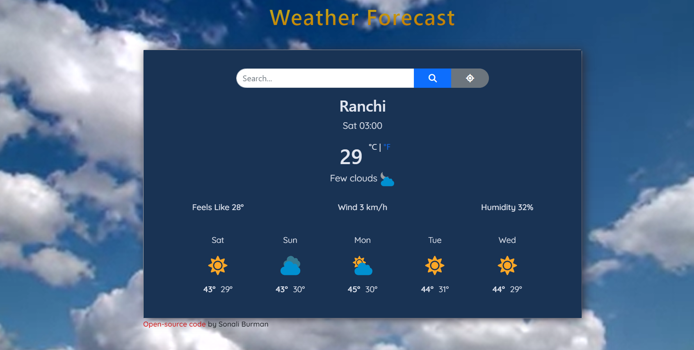
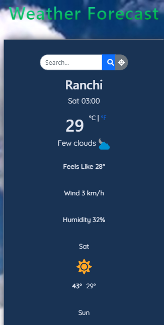

# Weather App

A simple weather forecasting application that provides current weather conditions and a 5-day weather forecast for any city. The app uses the OpenWeatherMap API to fetch weather data and displays it with a clean and modern user interface.

## Table of Contents

- [Features](#features)
- [Tech Stack](#tech-stack)
- [APIs Used](#apis-used)
- [Setup Instructions](#setup-instructions)
- [Usage](#usage)
- [Screenshots](#screenshots)
- [Live Demo](#live-demo)
- [License](#license)
- [Credits](#credits)

## Features

- Search for weather information by city name.
- Get the current temperature, feels like temperature, humidity, wind speed, and weather description.
- Display weather icons based on current conditions.
- Toggle between Celsius and Fahrenheit units.
- Fetch and display a 5-day weather forecast.
- Automatically get weather information based on the user's current location.
- Responsive design suitable for both desktop and mobile devices.
- Attractive background video for an enhanced visual experience.

## Tech Stack

- HTML5
- CSS3
  - Bootstrap 5
  - Google Fonts
- JavaScript
  - Axios for API requests
- OpenWeatherMap API

## APIs Used

- [OpenWeatherMap API](https://openweathermap.org/api) for fetching weather data.

## Setup Instructions

1. **Clone the repository**:

   ```bash
   git clone https://github.com/Sonali020200/Deltatech-Gaming-Limited.git
   cd Deltatech-Gaming-Limited
    ```

2. **Open the project:**

- You can open the `index.html` file directly in your browser to view the app.

3. **Add your API key:**

- Replace the API key in script.js with your own OpenWeatherMap API key.


## Usage

1. **Search for a City:**

- Enter the city name in the search box and click the search button or press enter.
- The app will display the current weather information and a 5-day forecast for the entered city.

2. **Use Current Location:**

- Click the location button to allow the app to fetch and display weather information based on your current geographic location.

3. **Toggle Units:**

- Click on the °C or °F links to toggle between Celsius and Fahrenheit units for temperature.

## Screenshots

**Desktop view**




**Mobile view**




## Live Demo

Check out the live demo of the app [here](https://weather-app-code-world.vercel.app/).


## License

This project is open-source and available under the [MIT License](LICENSE).

## Credits

- Background video from [Mazwai](https://mazwai.com/videvo_files/video/free/2015-07/small_watermarked/Clouds_1_1_preview.webm)
- Icons and weather data provided by [OpenWeatherMap](https://openweathermap.org/)
- Fonts from [Google Fonts](https://fonts.google.com/)
- Hosted by [GitHub Pages](https://pages.github.com/)

## Contact

For any inquiries or feedback, please contact Sonali Burman at [sonali.b.020200@gmail.com].

---

This project is maintained by Sonali Burman. Contributions, issues, and feature requests are welcome!
